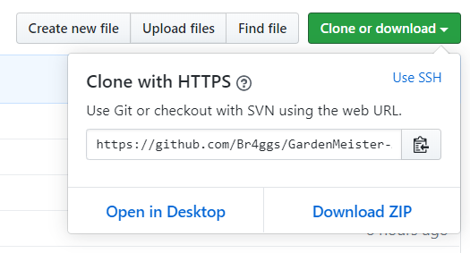
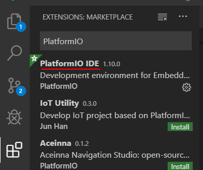
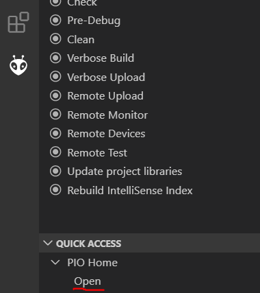
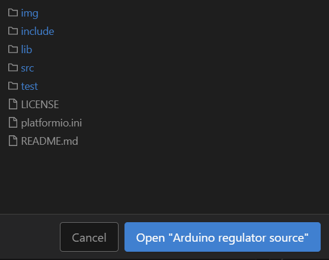
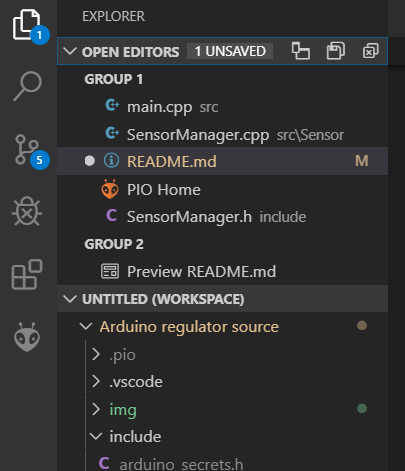
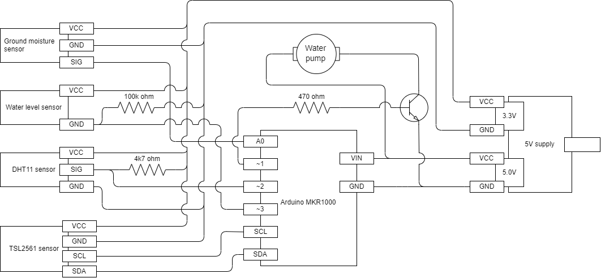
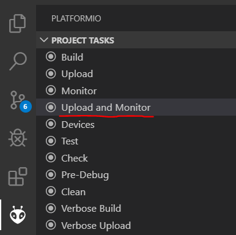

# GardenMeister-Arduino
Arduino source code for the GardenMeister project

# Required Hardware
* [Arduino MKR1000 (wifi)](https://store.arduino.cc/arduino-mkr1000-wifi)
* [Grove Moisture Sensor](http://wiki.seeedstudio.com/Grove-Moisture_Sensor/)
* [DHT11 Temperature & Humidity Sensor](https://www.adafruit.com/product/386)
* [Water Level Switch](https://www.kiwi-electronics.nl/water-liquid-level-sensor-switch?lang=en)
* [Breadboard Power Supply](https://www.make.net.za/product/breadboard-power-supply/) (You can pick something less janky as long as it can provide both 5V and 3.3V)
* TSL2561 luminosity sensor (coming soon)


# Setup
## Download sourcecode
Download this repository locally either by:
* Downloading the project as a zip:
* Cloning the project locally via git: `git clone https://github.com/Br4ggs/GardenMeister-Arduino.git`



## Install Visual Studio Code
This is required for the arduino extention used by this project.

If you do not have VSCode installed already you can do so [here](https://code.visualstudio.com/).

## Install the VSCode extention PlatformIO
This is used to do embedded board development in C++.
* Go to the integrated VSCode Extention Marketplace.
* Search and install the PlatformIO extention.
* Install it.



**Note: PlatformIO uses it's own project structure. Therefore, you can only upload this codebase to your arduino using PlatformIO.**

## Open the Gardenmeister project via PlatformIO
Per default, the PlatformIO Home menu will automatically
open when you start up VSCode. If this isn't the case, you can open the PlatformIO Home menu manually by clicking on the PlatformIO tab, going to quick access and clicking the `Open` option under the PIO Home drawer.



Once you are on the PIO Home page, click the `Open Project` button and navigate to the location you downloaded the project to. Once you navigated to the folder that contains the `platformio.ini` file, click the blue 'Open' button.



If everything went correct, you should now have the project open in VSCode. You can check this by opening the `Explorer` tab.



## Create an `arduino_secrets.h` file
This file will contain constants required to connect to wifi and the server. Make a file called `arduino_secrets.h` in the `include` directory.
Copy and paste the following code into the file:
```
#ifndef SECRETS_H
#define SECRETS_H

#define SECRET_SSID "access point name"
#define SECRET_PASS "access point password"

#define SERVER_ADDRESS "server address"
#define SERVER_PORT server port

#endif
```
Go ahead and fill in the variables as follows:
* `"access point name"`: name of the wifi router, as a string.
* `"access point password"`: password for said router, as a string.
* `"server address"`: ip/address of server, as a string.
* `server port`: port on which the server recieves http requests, as an integer.

## Download required libraries
Gardenmeister uses a couple of external libraries you will need to install in order for Gardenmeister to function. It is strongly recommended you use the PlatformIO library browser for this.

Go back to the PlatformIO Quick Access menu and click on `PIO Home > Libraries`. Search and install the following libraries:
* WiFi101 by Arduino
* Adafruit Unified Sensor by Adafruit
* DHT sensor library by Adafruit
* ArduinoJson by Benoit Blanchon

## Set up the hardware
Now that you have the codebase and neccesary plugin to flash the arduino. Go ahead and set up your hardware according to the following diagram:



## Upload and Monitor code to arduino
Once you have your arduino MKR1000 set up, upload and monitor the codebase by once again opening the PlatformIO tab and clicking on the `Upload and Monitor` option under Project Tasks.



You should see a bunch of output starting to appear in the terminal. After compilation and upload the terminal might ask you to input the name of the serial port the arduino is connected to. If you're not sure which one it is (it will usually be something like COM9 or COM10), you can use the arduino IDE to figure out which port to input.

If the codebase won't compile, check if you installed the required libraries(these are listed in the `platformio.ini` file) and read the error message. If this doesn't help, consider opening an issue on this repository.

## Additional step: working without serial connection
Additionally, you can disable serial statements by commenting out the `#define REGULATOR_DEBUG` in the `stdlib.h` file. This will disable all the `DEBUG_LOG()` and `DEBUG_LOGLN()` statements. This is usefull for when you plan to power the arduino with a power source other than the serial connection to a laptop, like a battery for example.

**Note: In order for this to work correctly you cannot call `Serial.print()` or `Serial.println()` directly! Use the `DEBUG_LOG()` and `DEBUG_LOGLN()` defenitions respectively.**